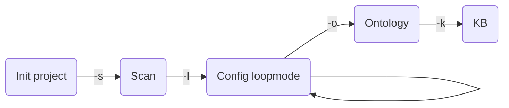

# Ontology Prototyper
Ce projet est le fruit d'une collabration avec l'entreprise [Perfect Memory](https://www.perfect-memory.com/), spécialiste du déploiement de solutions sémantiques.
## Objectifs
Cette application a pour objectif de simplifier la production d'une ontologie et d'une base de connaissances à partir de données existantes aux formats CSV ou JSON.

## Fonctionnement
L'application analyse un ou plusieurs fichiers de données pour construire un fichier de paramètres spécifiques.
Une fois les paramètres finalisés par l'utilisateur, l'application produit un fichier d'ontologie et un fichier contenant la KB.

Pour initier le projet, rassembler les fichiers de données et créer un fichier de configuration.

Ensuite l'application procède en 4 étapes:
1. Scan des données à transformer: pour chaque fichier l'application identifie toutes les colonnes et leur type de données puis renseigne le fichier de configuration.
2. Paramétrage du fichier de modélisation sémantique : l'application alimente de façon continue un journal d'erreurs à résoudre. Une fois que tous les paramètres obligatoires sont correctement définis, l'application rend la main pour les étapes suivantes.
3. Production de l'ontologie : l'application produit un fichier modèle de l'ontologie.
4. Production d'une base de connaissances (KB) :  : l'application produit un fichier restituant les données scannées de façon sémantisée, en cohérence avec l'ontologie.

L'application produit par défaut des fichiers au format turtle (.ttl) mais utilise la librairie [RDFLib](https://rdflib.readthedocs.io/) qui propose d'autres formats de sortie.

## Pré-requis
* Pour utiliser depuis le code source: Python 3.8+
* L'application peut être packagée en exécutable autonome grâce à PyInstaller, un fichier `prototype.spec` est fourni. Dans le cas d'une utilisation packagée, aucune connaissance en programmation n'est nécessaire.
* L'usage de l'application nécessite de bonnes bases en sémantique : principes des ontologies, connaître les différences entre Object Properties et DataType Properties, labels, prédicats etc. Pour plus d'informations consulter [OWL - Semantic Web Standards - W3C](https://www.w3.org/OWL/)

## Fonctionnalités
* Imports CSV et JSON paramétrables
* Multi-tables, une ou plusieurs classes par tables
* Implémentation d'ontologies internes ou de références: [Schema.org](https://schema.org/), [The Organization Ontology
](https://www.w3.org/TR/vocab-org/), [DBpedia](https://www.dbpedia.org/), [Wikidata](https://www.wikidata.org/wiki/Wikidata:Main_Page), etc.
* Construction automatique des prédicats sur la base des noms de colonnes
* Analyse récursive des documents JSON
* Import par lot pour les gros fichiers CSV avec filtrage des clés primaires
* Dispatching des données dans des entités ou des classes
* Formats de sortie : turtle, rdf+xml, n3, etc. [liste](https://rdflib.readthedocs.io/en/stable/plugin_serializers.html)

