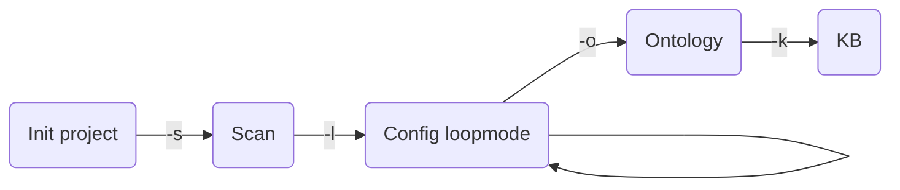

# Ontology Prototyper
Ce projet est le fruit d'une collabration avec l'entreprise [Perfect Memory](https://www.perfect-memory.com/), spécialiste du déploiement de solutions sémantiques.
## Objectifs
Cette application a pour objectifs de simplifier la production d'une base de connaissances et d'une ontologie depuis une base de données non sémantique comme des exports SQL ou JSON.
L'application accepte un ou plusieurs fichiers de données aux formats CSV ou JSON. Elle produit par défaut un fichier TTL pour l'ontologie et un fichier TTL pour la KB.
L'application utilise la librairie [RDFLib](https://rdflib.readthedocs.io/) qui propose d'autres formats de sortie.
## Fonctionnement
L'application procède en 4 étapes:
1. Scan des données à transformer
2. Paramétrage du fichier de modélisation sémantique
3. Production de l'ontologie
4. Production d'une base de connaissances (KB) contenant les données scannées

## Pré-requis
* Pour utiliser depuis le code source: Python 3.8+
* L'application peut être packagée en exécutable autonome grâce à PyInstaller, un fichier `prototype.spec` est fourni. Dans le cas d'une utilisation packagée, aucune connaissance en programmation n'est nécessaire.
* L'usage de l'application nécessite de bonnes bases en sémantique : principes des ontologies, connaître les différences entre Object Properties et DataType Properties, labels, prédicats etc. Pour plus d'informations consulter [OWL - Semantic Web Standards - W3C](https://www.w3.org/OWL/)
