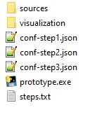
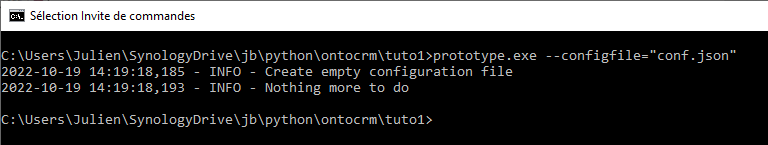
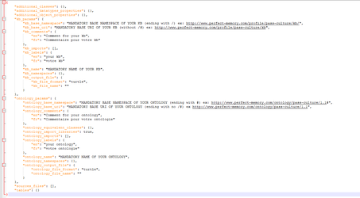
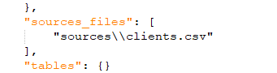
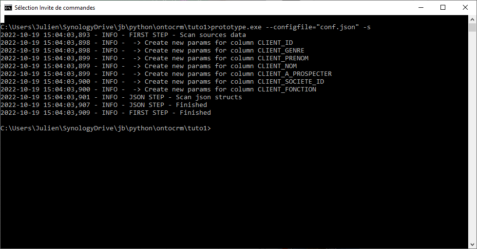
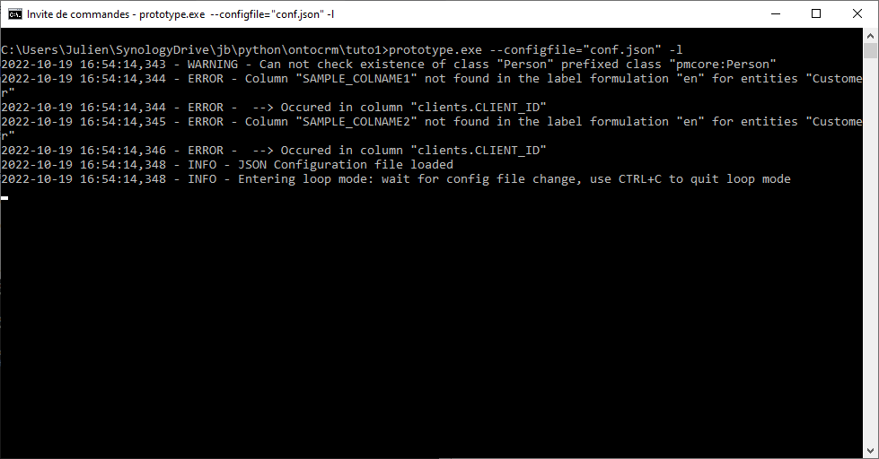
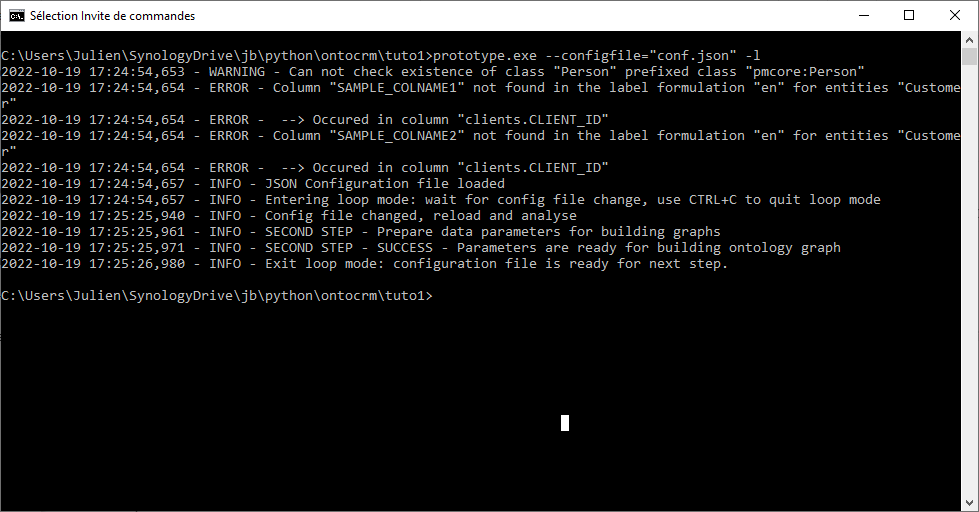
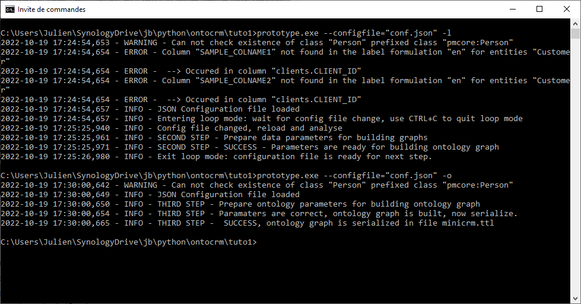

# Prototypeur autonome - Tutoriel n°1

Pour ce tutoriel, avant tout vérifier d'avoir le répertoire contenant
l’application ainsi qu'un sous-répertoire contenant les fichiers sources
et le répertoire de visualisation.

Le répertoire *sources* contient un seul fichier client. CSV

le répertoire *visualization* contient un outil de visualisation du
modèle créé

# Étape 1 - Création d’un fichier de configuration

La première étape consiste à construire un fichier de configuration

pour créer un fichier de configuration modèle utiliser le paramètre
*--configfile* suivi du nom du fichier de configuration à créer

Le template créé contient les grandes sections de paramètres pour le
prototypage

Les 3 premières sections seront expliquées par la suite, les sections
*kb_params* et *ontology_params* contiennent les paramètres de
l’ontologie et de la KB.

Les noms *kb_base_uri* et *ontology_base_uri* peuvent être paramétrés
selon les exemples donnés, les champs x\_*base_namespace* seront ensuite
automatiquement complétés.

Noter l'adresse des fichiers de sortie *kb_output_file* et
*ontology_output_file* contiennent le format à utiliser (par défaut
turtle) ainsi que les noms de fichiers de sortie: ces champs seront
automatiquement complétés grâce aux noms donnés pour l’ontologie et la
kb.

Video: [Premiers paramètres
automatiques](https://www.youtube.com/watch?v=2KXCCpaE82M)

# Étape 2 - Scan des données

Durant cette étape l’application va scanner les données contenues dans
le fichier source pour identifier différentes colonnes et pour leur
attribuer un nom et un type de données.

Pour le premier cas d’une table simple, nous nous allons renseigner un
seul nom de fichier source: le fichier clients.csv

Pour les autres paramètres, nous pourront reprendre le fichier fourni
intitulé conf-step1.json

Une fois le nom du fichier source renseigné, on demande à l'application
de scanner les données grâce à l’option -s

| CLIENT_ID | CLIENT_GENRE | CLIENT_PRENOM | CLIENT_NOM | CLIENT_A\_PROSPECTER | CLIENT_SOCIETE_ID | CLIENT_FONCTION      |
|-----------|--------------|---------------|------------|----------------------|-------------------|----------------------|
| 1         | M            | Jean          | BONBEUR    | 0                    | 1                 | Chefferie de projet  |
| 2         | M            | Jacques       | HADIT      | 1                    | 1                 | Achats               |
| 3         | M            | Marc          | REPERE     | 1                    | 2                 | Chefferie de projet  |
| 4         | M            | Paul          | HENNE      | 0                    | 2                 | Chefferie de service |
| 5         | Me           | Sarah         | CROCHE     | 1                    | 2                 | Direction            |

Le fichier clients.csv

Vidéo: [Scan des données source](https://youtu.be/noUJ9Vtn-gU)

"tables": {

"sources\\\clients.csv": {

"columns": {

"CLIENT_A\_PROSPECTER": {

"column_type": "CT_IGNORE or CT_PRIMARY_KEY or
CT_DATATYPE_PROPERTY_VALUE or CT_DATATYPE_PROPERTY_KEY or
CT_OBJECT_PROPERTY_VALUE or CT_OBJECT_PROPERTY_KEY or
CT_CLASSES_LIST_KEY or CT_JSON_EXPAND or CT_JSON_STRUCT",

"info_data_diversity": 2,

"info_data_values_set": "{0, 1}",

"info_sample_data": 1,

"xsd_type": "xsd:boolean"

},

"CLIENT_FONCTION": {

"column_type": "CT_IGNORE or CT_PRIMARY_KEY or
CT_DATATYPE_PROPERTY_VALUE or CT_DATATYPE_PROPERTY_KEY or
CT_OBJECT_PROPERTY_VALUE or CT_OBJECT_PROPERTY_KEY or
CT_CLASSES_LIST_KEY or CT_JSON_EXPAND or CT_JSON_STRUCT",

"info_data_diversity": 4,

"info_data_values_set": "{'Achats', 'Direction', 'Chefferie de projet',
'Chefferie de service'}",

"info_sample_data": "Achats",

"xsd_type": "xsd:string"

},

"CLIENT_GENRE": {

"column_type": "CT_IGNORE or CT_PRIMARY_KEY or
CT_DATATYPE_PROPERTY_VALUE or CT_DATATYPE_PROPERTY_KEY or
CT_OBJECT_PROPERTY_VALUE or CT_OBJECT_PROPERTY_KEY or
CT_CLASSES_LIST_KEY or CT_JSON_EXPAND or CT_JSON_STRUCT",

"info_data_diversity": 2,

"info_data_values_set": "{'M', 'Me'}",

"info_sample_data": "M",

"xsd_type": "xsd:string"

},

"CLIENT_ID": {

"column_type": "CT_IGNORE or CT_PRIMARY_KEY or
CT_DATATYPE_PROPERTY_VALUE or CT_DATATYPE_PROPERTY_KEY or
CT_OBJECT_PROPERTY_VALUE or CT_OBJECT_PROPERTY_KEY or
CT_CLASSES_LIST_KEY or CT_JSON_EXPAND or CT_JSON_STRUCT",

"info_data_diversity": 5,

"info_data_values_set": "{1, 2, 3, 4, 5}",

"info_sample_data": 1,

"xsd_type": "xsd:integer"

},

"CLIENT_NOM": {

"column_type": "CT_IGNORE or CT_PRIMARY_KEY or
CT_DATATYPE_PROPERTY_VALUE or CT_DATATYPE_PROPERTY_KEY or
CT_OBJECT_PROPERTY_VALUE or CT_OBJECT_PROPERTY_KEY or
CT_CLASSES_LIST_KEY or CT_JSON_EXPAND or CT_JSON_STRUCT",

"info_data_diversity": 5,

"info_data_values_set": "{'HENNE', 'REPERE', 'CROCHE', 'BONBEUR',
'HADIT'}",

"info_sample_data": "HADIT",

"xsd_type": "xsd:string"

},

"CLIENT_PRENOM": {

"column_type": "CT_IGNORE or CT_PRIMARY_KEY or
CT_DATATYPE_PROPERTY_VALUE or CT_DATATYPE_PROPERTY_KEY or
CT_OBJECT_PROPERTY_VALUE or CT_OBJECT_PROPERTY_KEY or
CT_CLASSES_LIST_KEY or CT_JSON_EXPAND or CT_JSON_STRUCT",

"info_data_diversity": 5,

"info_data_values_set": "{'Paul', 'Jean', 'Jacques', 'Marc', 'Sarah'}",

"info_sample_data": "Paul",

"xsd_type": "xsd:string"

},

"CLIENT_SOCIETE_ID": {

"column_type": "CT_IGNORE or CT_PRIMARY_KEY or
CT_DATATYPE_PROPERTY_VALUE or CT_DATATYPE_PROPERTY_KEY or
CT_OBJECT_PROPERTY_VALUE or CT_OBJECT_PROPERTY_KEY or
CT_CLASSES_LIST_KEY or CT_JSON_EXPAND or CT_JSON_STRUCT",

"info_data_diversity": 2,

"info_data_values_set": "{1, 2}",

"info_sample_data": 1,

"xsd_type": "xsd:integer"

}

},

"data_options": {

"CSV_SEPARATOR": ";",

"limited_primary_keys_list": null,

"specific_skipped_values": \[\],

"stop_on_duplicate_primary_key": true

},

"table_name": "clients",

"table_type": "TT_CLASS",

"table_type_parameters": {

"table_class_labels": {

"en": "Clients",

"fr": "Clients"

},

"table_class_name": "Clients",

"table_class_subclass_of": \[\]

}

}

}

Le scan du fichier source a provoqué la création d'une section de table
avec une liste des colonnes rencontrées. Pour chaque colonne, il crée
une section contenant le nom de la colonne et fournit les informations
nécessaires pour l'étape suivante, à savoir le type de colonne et le
type de données à utiliser.

Pour plus de détails sur les options de types de colonne, voir la page
dédiée au type de colonne :
<https://perfectmemory.atlassian.net/l/cp/A6hVNLV1>

Pour la section des paramètres de la table :

"tables": {

"sources\\\clients.csv": {

"columns": {... },

"data_options": {

"CSV_SEPARATOR": ";",

"limited_primary_keys_list": null,

"specific_skipped_values": \[\],

"stop_on_duplicate_primary_key": true

},

"table_name": "clients",

"table_type": "TT_CLASS",

"table_type_parameters": {

"table_class_labels": {

"en": "Clients",

"fr": "Clients"

},

"table_class_name": "Clients",

"table_class_subclass_of": \[\]

}

}

}

Le nom de la table table_name sera utilisé dans les logs. Le type de
classe utilisé TT_CLASS va définir une table de classe, c'est-à-dire une
table qui va servir à la création d'une ou plusieurs classes. Ensuite,
dans les paramètres, on va retrouver notamment table_class_namequi sera
le nom de la classe associée au concept de client avec les labels de la
classe ainsi que ses liens de parenté si cette classe a créé et sous
classe d'une autre. Les noms ont été renseignés automatiquement sur la
base du nom du fichier, il est possible de modifier ces paramètres avant
la création de l’ontologie. Ici nous renommerons le champ
table_class_name de la valeur Clients à *Customer*. Et nous mettrons en
paramètre table_class_subclass_of la classe *pmcore:Person*.

"table_type_parameters": {

"table_class_labels": {

"en": "Clients",

"fr": "Clients"

},

"table_class_name": "Customer",

"table_class_subclass_of": \[ "pmcore:Person" \]

}

Dans un premier temps, tous les paramètres liés au type de colonne, à
l'exception de l’ID du client, seront définis comme des data type
properties: reprendre les paramètres du fichier *conf-step2.json*:
toutes les colonnes ont été définies comme CT_DATATYPE_PROPERTY_VALUE à
l’exception de la colonne CLIENT_ID qui est définie comme CT_PRIMARY_KEY

Pour aller plus loin sur le fichier de configuration après scan des
données: [Vidéo](https://youtu.be/JD7LaYL0bCY)

# Étape 3 - Configuration progressive

Une fois les types de colonne définis, nous pouvons lancer l’application
dans un mode de boucle afin de créer un jeu de questions-réponses qui se
conclura lorsque l'application aura suffisamment de paramètres pour
générer l’ontologie et là KB:

prototype.exe --configfile="conf.json" -l

C'est le paramètre *-l* qui lance le mode boucle: durant le mode boucle
l’application surveille le fichier de configuration et relance une
analyse chaque fois qu'il est modifié par l’utilisateur. Une fois que
tous les paramètres sont suffisants, l’application quitte le mode boucle
et revient en ligne de commande.

Pour cet exemple simple, l’application génère une erreur qui est
identifiée au niveau de la table *clients* et de la colonne *client_id*
: l’erreur concerne les labels d'entités. Les colonnes du type
CT_PRIMARY_KEY ont un champ particulier column_entities_labels_struct
qui a pour objectif de paramétrer les labels des entités à créer pour
chaque entrée de la table. Les noms à utiliser doivent correspondre avec
un nom de colonne de la table. Ici la valeur qui fait erreur est la
valeur par défaut donnée en exemple: SAMPLE_COLNAME1 et SAMPLE_COLNAME2.
Il faut modifier ces deux noms afin d’utiliser les prénoms et non des
clients comme label des entités.

"column_entities_labels_struct": {

"en": "Label {SAMPLE_COLNAME1} {SAMPLE_COLNAME2}",

"fr": "Label {SAMPLE_COLNAME1} {SAMPLE_COLNAME2}"

}

Nous utiliserons les colonnes CLIENT_NOM et CLIENT_PRENOM :

"column_entities_labels_struct": {

"en": "{CLIENT_PRENOM} {CLIENT_NOM}",

"fr": "{CLIENT_PRENOM} {CLIENT_NOM}"

}

En procédant ainsi, au moment de la construction de la KB, à chaque
ligne de la table *clients* sera associée une entité de la classe
*Customer* ayant un label construit à l’aide des valeurs de prénom et
nom du client.

Une fois cette modification effectuée, l’application valide les
paramètres et quitte le mode boucle.

# Étape 4 - Construction de l’ontologie

Pour demander la création du fichier d’ontologie, utiliser le paramètre
-o

prototype.exe --configfile="conf.json" -o

Un fichier *minicrm.ttl* a été créé

@prefix : \<http://www.perfect-memory.com/ontology/minicrm/1.1#\> .

@prefix owl: \<http://www.w3.org/2002/07/owl#\> .

@prefix pmcore: \<http://www.perfect-memory.com/ontology/pmcore/1.1#\> .

@prefix rdfs: \<http://www.w3.org/2000/01/rdf-schema#\> .

@prefix xsd: \<http://www.w3.org/2001/XMLSchema#\> .

\<http://www.perfect-memory.com/ontology/minicrm/1.1\> a owl:Ontology ;

rdfs:label "MiniCRM"@en,

"MiniCRM"@fr ;

rdfs:comment "MiniCRM"@en,

"MiniCRM"@fr ;

owl:imports \<http://www.perfect-memory.com/ontology/pmcore/1.1\>,

\<http://www.perfect-memory.com/ontology/pmmodel/1.1\> .

:has_client_a\_prospecter a owl:DatatypeProperty,

owl:FunctionalProperty ;

rdfs:label "has_client_a\_prospecter"@en,

"has_client_a\_prospecter"@fr ;

rdfs:domain :Customer ;

rdfs:range xsd:boolean .

:has_client_fonction a owl:DatatypeProperty,

owl:FunctionalProperty ;

rdfs:label "has_client_fonction"@en,

"has_client_fonction"@fr ;

rdfs:domain :Customer ;

rdfs:range xsd:string .

:has_client_genre a owl:DatatypeProperty,

owl:FunctionalProperty ;

rdfs:label "has_client_genre"@en,

"has_client_genre"@fr ;

rdfs:domain :Customer ;

rdfs:range xsd:string .

:has_client_nom a owl:DatatypeProperty,

owl:FunctionalProperty ;

rdfs:label "has_client_nom"@en,

"has_client_nom"@fr ;

rdfs:domain :Customer ;

rdfs:range xsd:string .

:has_client_prenom a owl:DatatypeProperty,

owl:FunctionalProperty ;

rdfs:label "has_client_prenom"@en,

"has_client_prenom"@fr ;

rdfs:domain :Customer ;

rdfs:range xsd:string .

:has_client_societe_id a owl:DatatypeProperty,

owl:FunctionalProperty ;

rdfs:label "has_client_societe_id"@en,

"has_client_societe_id"@fr ;

rdfs:domain :Customer ;

rdfs:range xsd:integer .

:Customer a owl:Class ;

rdfs:label "Clients"@en,

"Clients"@fr ;

rdfs:subClassOf pmcore:Person .

# Pour aller plus loin

Dans cette configuration, une seule classe « Customer » est créée et
chaque entrée de la table donne lieu à une entité de Customer.

Pour aller plus loin nous allons transformer la colonne CLIENT_FONCTION
en un concept indépendant « Position » afin que chaque client soit relié
sémantiquement à une entité d’un concept fonction. Nous aurons alors
deux classes : une classe Customer et une classe Position.

Pour ce faire nous allons passer le type de la colonne CLIENT_FONCTION
de DTP à OP_KEY

Ce changement n’impacte pas les données sources donc il n’est pas
nécessaire de refaire l’étape de scan des données

Relancer l’application avec l’option -l afin de prendre en compte la
nouvelle configuration

De nouveaux champs à paramétrer apparaissent, ils concernent la classe
« Position » à créer ainsi que l’object property qui servira à relier
cette nouvelle classe à la classe « Customer » existante :

- target_class_name est le nom de la classe à créer et à laquelle
  associer les entités depuis la colonne CLIENT_FONCTION. Nous
  l’appellerons « Position ».

- column_entities_labels_struct fonctionne identiquement à la colonne
  CLIENT_ID : elle servira à paramétrer les labels des entités. Ici nous
  n’avons que la fonction donc nous mettrons ce champ à la valeur {
  "en": "{CLIENT_FONCTION}", "fr": "{CLIENT_FONCTION}" } afin que chaque
  entité apparaisse sous la forme de l’intitulé de la fonction

- predicate_name est l’intitulé du prédicat de l’object property à
  créer, c’est le prédicat qui va relier les entités de la classe
  « Customer » à la classe « Position ». Il est proposé
  automatiquement : « has_clientFonction ». Chaque prédicat créé
  automatiquement se voit attribué un préfix « has\_ » suivi d’une
  composition basée sur l’intitulé de la colonne modifiée pour ne plus
  contenir d’accent ni de prépositions du type « de, du, le, la etc. »

- is_functional_property concerne l’object property associée au
  prédicat: laisser true pour que chaque client ne puisse avoir qu’une
  seule fonction ce sera alors une functional property

- subproperty_of concerne aussi l’object property associée au prédicat :
  il permet d’affilier la relation à une autre relation, la relation
  crée sera alors subproperty_of des prédicats listés.

Avant sauvegarde des modifications, la console du mode boucle indique
que la colonne CLIENT_FONCTION à une target_class_name à None,
effectuons les modifications et sauvons la configuration afin de
relancer l’analyse.

Les valeurs rencontrées dans cette colonne seront alors utilisées pour
créer des entités d’une classe Position et les relier par object
porperty aux entités de la table « Customer ».

"target_class_name": "Position"

Regénérons l’ontologie avec l’option -o et observons les modifications
dans le fichier turtle

:Position a owl:Class ;  
rdfs:label "Position"@en,  
"Position"@fr.

:has_clientFonction a owl:FunctionalProperty,  
owl:ObjectProperty ;  
rdfs:label "clientFonction"@en,  
"clientFonction"@fr ;  
rdfs:domain :Customer ;  
rdfs:range :Position .

On voit que les liens sont correctement créés entre les classes Customer
et Position : « Position » est une classe à part entière et
« has_clientFonction » est un prédicat qui associe une entité de la
classe Customer à une entité de la classe Position.

Observons l’impact de cette modification sur l’entête du fichier de
configuration : jusque-là la section additional_classes était vide elle
contient maintenant un élément :

"additional_classes": {  
"Position": {  
"ac_labels": {  
"en": "Position",  
"fr": "Position"  
},  
"ac_subclass_of": \[\]  
}  
}

Les trois sections

"additional_classes": {},  
"additional_datatypes_properties": {},  
"additional_object_properties": {},

Contiennent les classes et relations additionnelles aux tables : si
chaque table ne renseigne qu’une seule classe alors ces sections
resteront vides. En créant une classe supplémentaire depuis une colonne
d’une table comme nous l’avons fait alors la classe est dite
additionnelle et fait l’objet d’une entrée dans la section
additional_classes où il sera possible de paramétrer son label
(attention pas les labels des entités mais celui de la classe) ainsi que
ses relations de parentés. Nous pourrions ici attribuer des classes
parentes comme « pmcore :Entity » :

"ac_subclass_of": \["pmcore: Entity"\]

Si on souhaite plusieurs parents, les lister séparés d’une virgule :

"ac_subclass_of": \["pmcore: Entity", "schema:Occupation"\]

Point important sur le nom de la classe :

Définir une target_class_name dans une colonne d’une table provoque la
création d’une classe additionnelle du même nom, deux points
particuliers sont à souligner :

1.  Une fonction spécifique est utilisée pour normaliser ce nom. Il est
    donc normal que le premier nom renseigné manuellement se trouve
    modifié.

2.  Modifier le nom de la target_class_name après la création de la
    classe additionnelle nécessite de modifier à l’identique le nom de
    la classe additionnelle. Dans le cas contraire, une seconde classe
    additionnelle sera automatiquement créée et l’ancienne, avec ses
    paramètres, deviendra inutile. Si le mode boucle est activé,
    modifier les deux endroits avant de sauvegarder.

# 
